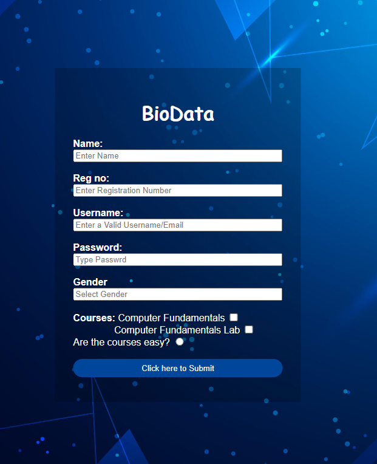

 

    

 

# HTML-CSS Form
## Introduction
Simple HTML Form designed with CSS. A small script of javascript is also used. This form was made for practicing front-end web dev. While experimenting with the CSS to design the form, same color scheme was kept in mind to have a cool looking form. 

##### The Key concepts which are used:
- HTML 
- CSS
- Javascript 
## Usage
1. Clone or download the repo.
2. Navigate to index.html
3. Open the the index.html file.
## License 
The scripts and documentation in this project are released under the MIT License.
